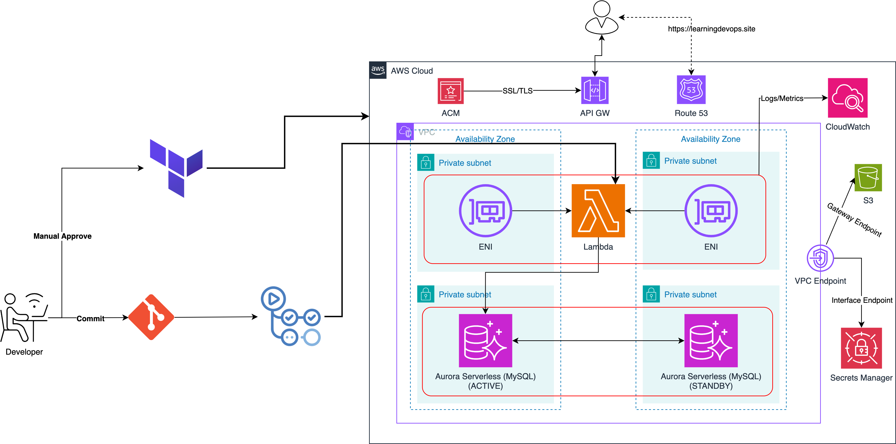

## Architecture Diagram



# Serverless Project

## Project Overview: Fully Serverless Inventory Management API
This project demonstrates a fully serverless architecture on AWS, leveraging managed services to build a scalable and secure Inventory Management API.

---

## Key Services and Their Functionality

### **API Gateway**
- Acts as the entry point for all API requests.
- Routes requests to the appropriate Lambda functions.
- Handles HTTP/REST protocols, API versioning (e.g., `/v1`), and environments (`dev`, `test`, `prod`).
- Manages authentication, throttling, and request/response transformations.

### **AWS Lambda**
- Executes the backend logic for the API without requiring server management.
- Automatically scales based on demand and integrates with other AWS services like S3, Aurora, and Secrets Manager.
- Logs and metrics are sent to CloudWatch for monitoring.

### **Aurora Serverless (MySQL)**
- Stores structured data for users and products.
- Provides high performance and scalability with automatic scaling and failover.
- Database credentials are securely managed by Secrets Manager.

### **Amazon S3**
- Stores binary image data (e.g., JPEG, JPG, PNG) for products.
- Accessed privately via a VPC Gateway Endpoint for enhanced security.

### **AWS Secrets Manager**
- Securely stores and rotates database credentials every 7 days.
- Credentials are accessed privately via a VPC Interface Endpoint.

### **AWS Certificate Manager (ACM)**
- Manages SSL/TLS certificates for secure HTTPS communication.
- Certificates are associated with API Gateway and Route 53.

### **Route 53**
- Provides DNS resolution for the custom domain used by the API Gateway.
- Ensures high availability and reliability.

### **VPC Endpoints**
- Enables private access to AWS services (e.g., Secrets Manager via Interface Endpoint, S3 via Gateway Endpoint).
- Eliminates the need for Internet Gateways or NAT Gateways.

### **IAM Roles and Security Groups**
- **IAM Roles**: Grant Lambda functions permissions to interact with S3, Aurora, CloudWatch, and Secrets Manager.
- **Security Groups**: Restrict access to resources within the VPC (e.g., database, endpoints).

### **CloudWatch**
- Monitors logs and metrics from Lambda functions for troubleshooting and observability.

---

## CI/CD Pipeline
- **GitHub Actions** automates the build, test, and deployment process.
- When code is pushed, tests are triggered automatically.
- After merging, the latest code is packaged and deployed to Lambda using AWS CLI commands.
- A dedicated IAM user with restricted permissions is created for GitHub Actions, and credentials are securely stored in GitHub Secrets.

---

## API Endpoints

### **User Management**
- **Health Check**:  
  `GET /healthz` - Verifies if the server is healthy.
- **Retrieve User Details**:  
  `GET /user/{userId}` - Fetches user details.
- **Add a New User**:  
  `POST /user` - Creates a new user.
- **Update User Details**:  
  `PUT /user/{userId}` - Updates user information.

### **Product Management**
- **Retrieve Product Details**:  
  `GET /product/{productId}` - Fetches product details.
- **Add a New Product**:  
  `POST /product` - Creates a new product.
- **Update Product Details**:  
  `PUT /product/{productId}` - Updates product information.
- **Partially Update Product Details**:  
  `PATCH /product/{productId}` - Modifies specific fields of a product.
- **Delete Product Details**:  
  `DELETE /product/{productId}` - Removes a product.

---

## Security Features
- **Secrets Manager**: Rotates database credentials securely.
- **VPC Endpoints**: Ensures private access to AWS services.
- **IAM Roles**: Grants least privilege access to resources.
- **Security Groups**: Restricts network access to sensitive resources.

---

## How to Deploy
1. Clone the repository:
   ```bash
   git clone https://github.com/your-repo/serverless-project.git
   cd serverless-project